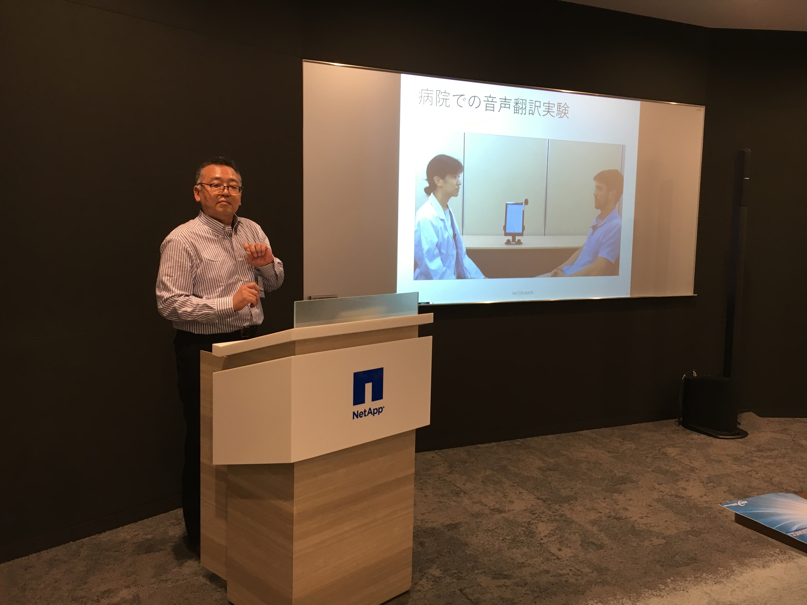
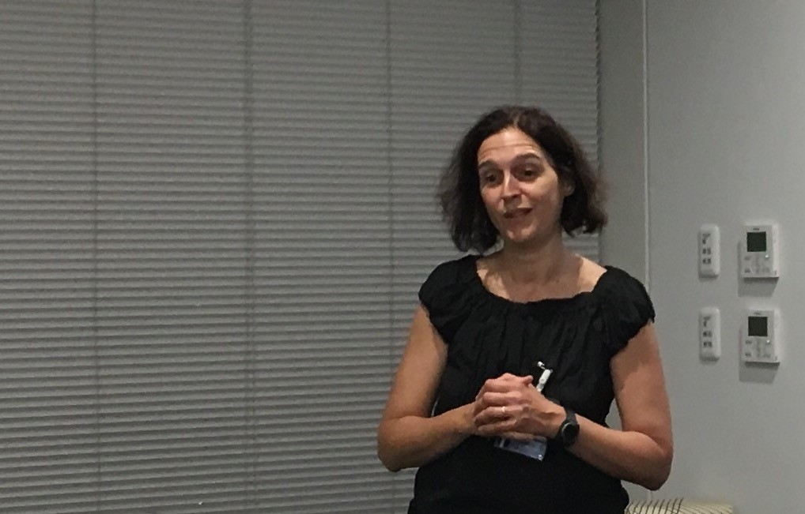
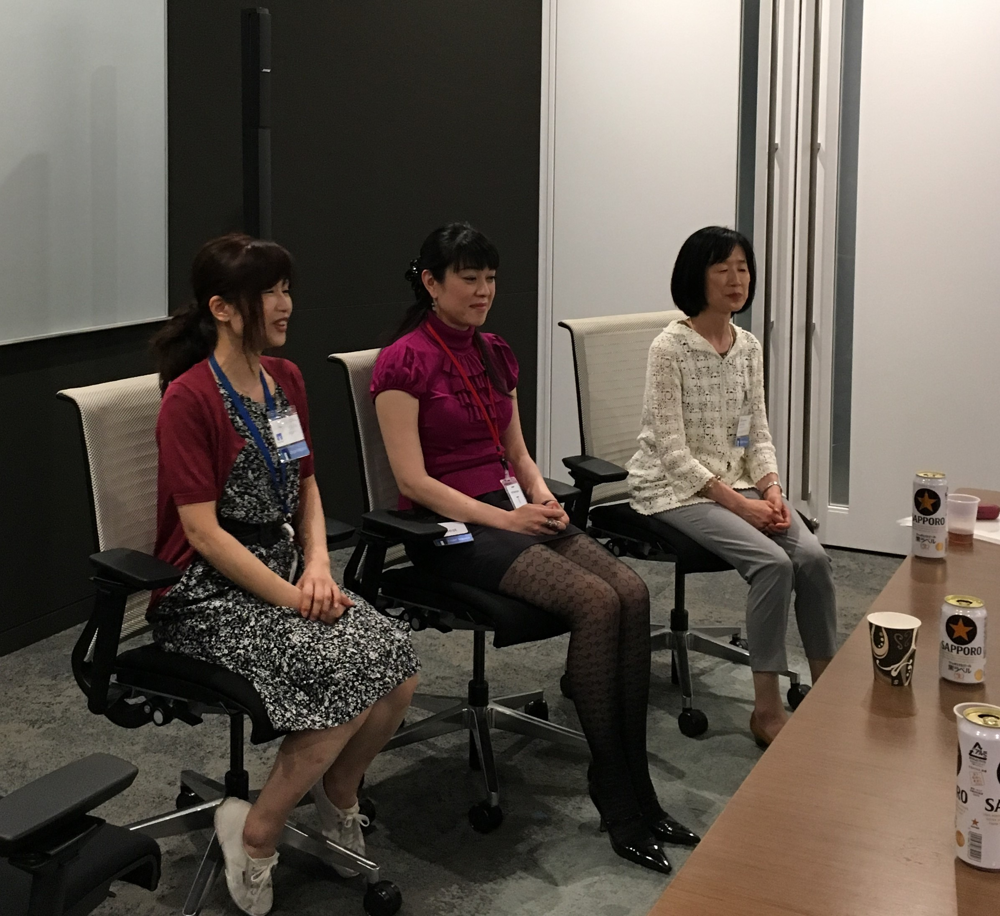

# Women in Localization Japan 第11回イベント

日時：2017年06月23日(金)19:00 ～ 21:30

開催場所：ネットアップ株式会社 会議室

## NMTアドバンスト講座
登壇者：隅田 英一郎/ Eiichiro Sumita/国立研究開発法人 情報通信研究機構

プレゼンテーションの冒頭では、総務省所管のNICT（National Institute of Information and Communications Technology）の取り組みや目的を紹介してくださいました。

開発ツールとして、多言語音声翻訳アプリである「VOICETRA」と、ユーザが学習させることのできる「みんなの自動翻訳@TexTra®」をデモを交えて説明してくださいました。

機械翻訳の現状やデメリットも指摘された上で、対訳データを増加させることによる翻訳精度の向上についても解説していただき、みんなの『翻訳バンク』についても案内してくださいました。

## 北京で開催されたローカリゼーション イベントについて
登壇者：Costanza Marinelli/ Larsen Globalization

## なぜ日本人はこんなに忙しいのか
### パネリスト
- 上田 有佳子/ Yukako Ueda/ ネットアップ株式会社/ Women in Localization Japan Chapter Manager 
- 澤村 雅以/ Mai Sawamura/ SDLジャパン株式会社/ Women in Localization Japan Operator 
- 田中 千鶴香/ Chizuka Tanaka/ 日本翻訳連盟理事

たとえばレビューアの業務では、外国で同等の業務をこなす担当者に比較して、日本の担当者の方が忙しそうに見えるのはなぜなのだろうかというようなディスカッションが展開されました。

上田氏はクライアントの視点から、澤村氏は翻訳会社のプロジェクト管理者の視点から、田中氏は個人翻訳者の視点から、以下のような意見が取り交わされました。

日本語という言語自体の難易度の高さのみが問題とは考えられない。

その他の言語に比較して読み手の許容範囲が狭いことが問題の1つとして挙げられる。

担当者の「好み」が大きく作用する。
